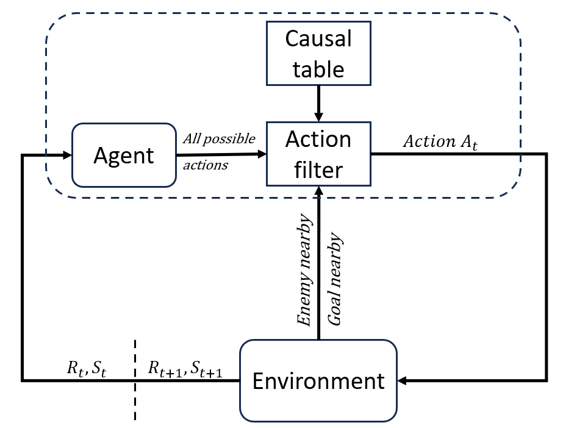

# Generalisable Improvement to Q-Learning Exploration with Causal Models of Core Environment Mechanics

This repository provides the Framework detailed in [Generalisable Improvement to Q-Learning Exploration with Causal Models of Core Environment Mechanics](https://www.ecai2024.eu/calls/main-track) that enables to integrate causal knowledge within the Q-Learning algorithm.



**Paper**: [Generalisable Improvement to Q-Learning Exploration with Causal Models of Core Environment Mechanics](https://www.ecai2024.eu/calls/main-track)
**Project website**: ...

**Maintainer**: [Giovanni Briglia](https://github.com/Giovannibriglia)  
**Affiliation**: [Distributed and Pervasive Intelligence Group](https://dipi-unimore.netlify.app/) at [University of Modena and Reggio Emilia](https://www.unimore.it/)  
**Contact**: [gbriglia@unimore.it](mailto:gbriglia@unimore.it)

## Project Structure

```
abstract.png

LICENSE

requirements.txt

results
|__Results_Comparison123
|__Results_Comparison4

resume_metrics
|__Metrics_Comparison123
|__Metrics_Comparison4

scripts
|__algorithms
   |__models.py
|__env
   |__env_game.py
|__launch_experimens
   |__launch_comparison123.py
   |__launch_comparison4.py
   |__launch_tradeoff_causality.py
   |__offline_heuristic_table.pkl
|__show_results
   |__view_plots.py
   |__plots.py
|__utils
   |__seed_values.npy
   |__images_for_gui
      |__bowser.png
      |__goal.png
      |__supermario.png
      |__wall.png

```

## Installation
1. Create a new python virtual environment with 'python 3.10'
2. Install 'requirements'
   ```
   pip install requirements
   ```
3. Try running example
   ```
   TODO: @gio sviluppa un breve test
   ```

## Configuration 
### Main Parameters
### Other Parameters

## How to Reproduce Paper Results


## How to Develop your Own Extension


## Citation 
```
@inproceedings{}
```

