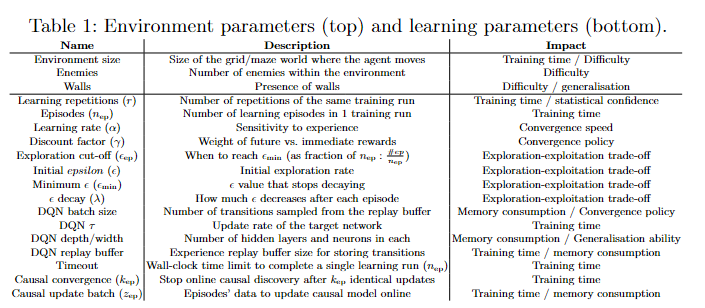

# Generalisable Improvement to Q-Learning Exploration with Causal Models of Core Environment Mechanics

This repository provides the Framework detailed in [Generalisable Improvement to Q-Learning Exploration with Causal Models of Core Environment Mechanics](https://www.ecai2024.eu/calls/main-track) that enables to integrate causal knowledge within the RL algorithms; in this paper we show how this can be done in Q-Learning and in DQN.


**Paper**: [Generalisable Improvement to Q-Learning Exploration with Causal Models of Core Environment Mechanics](https://www.ecai2024.eu/calls/main-track)
**Project website**: ...

**Maintainer**: [Giovanni Briglia](https://github.com/Giovannibriglia)  
**Affiliation**: [Distributed and Pervasive Intelligence Group](https://dipi-unimore.netlify.app/) at [University of Modena and Reggio Emilia](https://www.unimore.it/)  
**Contact**: [stefano.mariani@unimore.it](mailto:stefano.mariani@unimore.it) and [giovanni.briglia@unimore.it](mailto:giovanni.briglia@unimore.it) 

## Project Structure

```
*** TO COMPLETE ***
additional_assessments
   |__init__.py
   |__evaluation_for_test1_and_test3.py
   |__launcher_offline_CD_analysis.py
   |__launcher_offline_CD_analysis_multienv.py
   |__launcher_sensitive_analysis_batch_episodes_for_online_CD.py
   |__test1.py
   |__test2.py
   |__test3.py
images_for_render
   |__bowser.png
   |__goal.png
   |__supermario.png
   |__wall.png
Results
   |__Comparison123
   |__Comparison4
   |__OfflineCD_MultiEnv
   |__Test1
   |__Test3
scripts
   |__algorithms
      |__init__py
      |__causal_discovery.py
      |__dqn_agent.py
      |__q_learning_agent.py
      |__random_agent.py
   |__launchers
      |__init__.py
      |__launcher_comparison4_paper.py
      |__launcher_comparison123_paper.py
   |__utils
      |__init.py
      |__batch_episodes_for_online_cd_values.pkl
      |__dqn_class_and_memory.py
      |__environment.py
      |__exploration_strategies.py
      |__ground_truth_causal_graph.json
      |__ground_truth_causal_graph.png
      |__ground_truth_causal_table.pkl
      |__numpy_encoder_json.py
      |__others.py
      |__seed_values.npy
      |__train_models.py
   __init__.py
   plot_and_tables.py
Videos
   |__Comparison123
   |__Comparison4
abstract.png
global_variables.py
LICENSE
README
requirements.txt
```

## Installation
1. Create a new python virtual environment with 'python 3.10'
2. Install 'requirements'
   ```
   pip install -r requirements.txt
   ```
3. Install setup
   ```
   python setup.py install
   ```

## How to Reproduce Paper Results
   For comparison: Vanilla vs Causal Offline vs Online in Grid-like Environments:
   ```
   python scripts/launchers/launcher_comparison123_paper.py
   ```
   For comparison: With and Without Transfer Learning in Maze-like Environments:
   ```
   python scripts/launchers/launcher_comparison4_paper.py
   ```

## Parameters 

<p align="center">
  
</p>

## Develop your Own Extension
Your extension can take various paths:
1) One direction involves modifying the causal discovery algorithms.
2) Another direction entails adding new agents (currently Q-Learning and DQN have been developed). It's crucial to maintain consistency with the training class by implementing the "__update_Q_or_memory__", "__update_exp_fact__", "__select_action__" and "__return_q_table__" functions. Additionally, in the "global_variables.py" script, you need to include your custom label.
3) The third direction involves testing new environments.

## Citation  
```
@inproceedings{}
```

