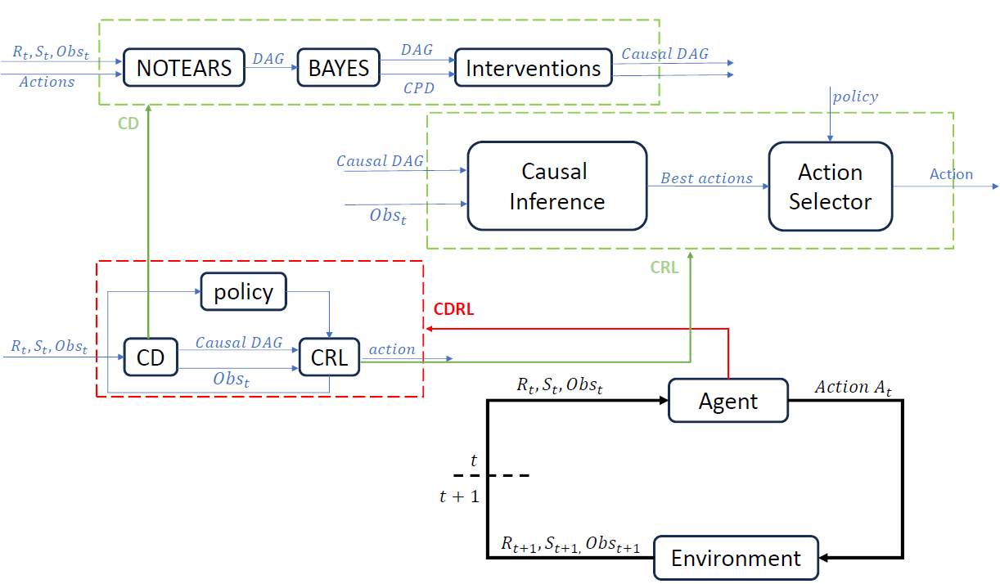
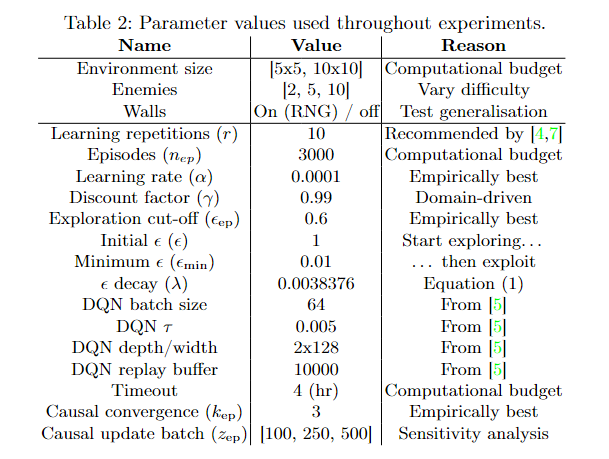

# Improving Reinforcement Learning-based Autonomous Agents with Causal Models

**Paper**: [Improving Reinforcement Learning-based Autonomous Agents with Causal Models]()

**Abstract**:
Autonomous Agents trained with Reinforcement Learning
(RL) must explore the effects of their actions in different environment
states to learn optimal control policies or build a model of such environment. 
Exploration may be impractical in complex environments, hence
ways to prune the exploration space must be found. In this paper, we
propose to augment an autonomous agent with a causal model of the core
dynamics of its environment, learnt on a simplified version of it and then
used as a “driving assistant” for larger or more complex environments.
Experiments with different RL algorithms, in increasingly complex environments, 
and with different exploration strategies, show that learning
such a model improves the agent behaviour.

**Keywords**: Autonomous Agents, Causal Discovery, Reinforcement Learning

**Maintainer**: [Giovanni Briglia](https://github.com/Giovannibriglia)  
**Affiliation**: [Distributed and Pervasive Intelligence Group](https://dipi-unimore.netlify.app/) at [University of Modena and Reggio Emilia](https://www.unimore.it/)  
**Contact**: [stefano.mariani@unimore.it](mailto:stefano.mariani@unimore.it) and [giovanni.briglia@unimore.it](mailto:giovanni.briglia@unimore.it)

<p align="center">
  
</p>


<p align="center">
    
    
</p>


## 1. Project Structure

```
additional_assessments
   |__init__.py
   |__1_evaluation_for_test1_and_test2.py
   |__1_test1_and_test2
   |__2_evaluation_sensitive_analysis_batch_episodes.py
   |__2_launcher_sensitive_analysis_batch_episodes_for_online_cd.py
   |__3_evaluation_test3.py
   |__3_test3.py
   |__4.1_launcher_offline_CD_analysis.py
   |__4.2_launcher_offline_CD_analysis_multienv.py
   |__init__.py
Plots_and_Tables
   |__Comparison123
      |__results.pkl
      |__results.xlsx
   |__Comparison4
      |__results.pkl
      |__results.xlsx
scripts
   |__algorithms
      |__init__py
      |__causal_discovery.py
      |__dqn_agent.py
      |__q_learning_agent.py
      |__random_agent.py
   |__launchers
      |__init__.py
      |__launcher_comparison4_paper.py
      |__launcher_comparison123_paper.py
   |__utils
      |__images_for_render
         |__bowser.png
         |__goal.png
         |__supermario.png
         |__wall.png
      |__init.py
      |__batch_episodes_for_online_cd_values.pkl
      |__dqn_class_and_memory.py
      |__environment.py
      |__exploration_strategies.py
      |__ground_truth_causal_graph.json
      |__ground_truth_causal_graph.png
      |__ground_truth_causal_table.pkl
      |__merge_causal_graphs.py
      |__others.py
      |__plot_and_tables.py
      |__seed_values.npy
      |__test_causal_table
      |__train_models.py
   __init__.py
   example.py
__init__.py
experiments_parameters.png
flowchart_resume.png
global_variables.py
LICENSE
README
requirements.txt
setup.py
values_reasons_parameters.png
```

## 2. Installation

1. Create a new python virtual environment with 'python 3.10'
2. Install 'requirements'
   ```
   pip install -r requirements.txt
   ```
3. Install setup
   ```
   python setup.py install
   ```
4. Run test example
   ```
   python3.10 -m scripts/example.py
   ```
   
## 3. How to Reproduce Paper Results
   For comparison: Vanilla vs Causal Offline vs Causal Online in Grid-like Environments:
   ```
   python setup.py install
   ```
   ```
   python3.10 -m scripts/launchers/launcher_comparison123_paper.py
   ```
   For comparison: With and Without Transfer Learning in Maze-like Environments:
   ```
   python setup.py install
   ```
   ```
   python3.10 -m scripts/launchers/launcher_comparison4_paper.py
   ```

## 4. Parameters

<p align="center">
  
</p>

<p align="center">
  
</p>

## 5. Results

### 5.1 Vanilla vs Causal Offline vs Causal Online

<p align="center">
  
</p>
<p align="center">
  
</p>

### 5.2 Transfer Learning
<p align="center">
  
</p>

## 6. Develop your Own Extension

Your extension can take various paths:
1) One direction involves modifying the causal discovery algorithms.
2) Another direction entails adding new kinds of agent (currently Q-Learning and DQN have been developed). It's crucial to maintain consistency with the training class by implementing the "__update_Q_or_memory__", "__update_exp_fact__", "__select_action__" and "__return_q_table__" functions. Additionally, in the "global_variables.py" script, you need to include your custom label.
3) The third direction involves testing new environments.

## References

[4] Colas, C., Sigaud, O., Oudeyer, P.Y. (2018). GEP-PG: Decoupling exploration and exploitation in deep reinforcement learning algorithms. *In Proceedings of the International Conference on Machine Learning*, PMLR, 1039–1048.

[5] Eimer, T., Lindauer, M., Raileanu, R. (2023). Hyperparameters in reinforcement learning and how to tune them. *In Proceedings of the 40th International Conference on Machine Learning*, PMLR. Available at: [https://proceedings.mlr.press/v202/eimer23a.html](https://proceedings.mlr.press/v202/eimer23a.html).

[7] Gorsane, R., Mahjoub, O., de Kock, R.J., Dubb, R., Singh, S., Pretorius, A. (2022). Towards a standardised performance evaluation protocol for cooperative MARL. *Advances in Neural Information Processing Systems*, 35, 5510–5521.

## Citation  
```
@inproceedings{}
```

